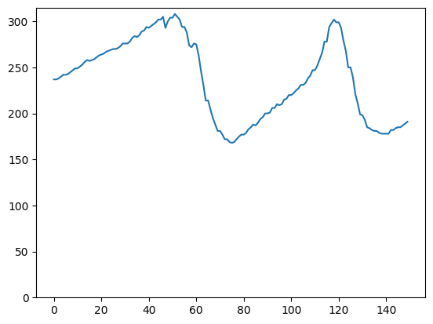
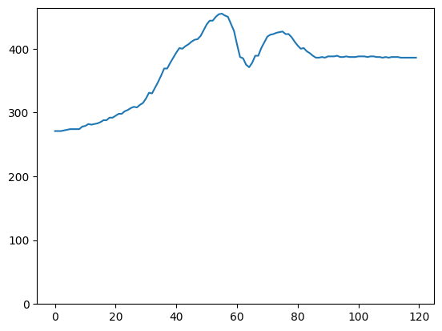
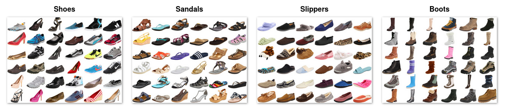
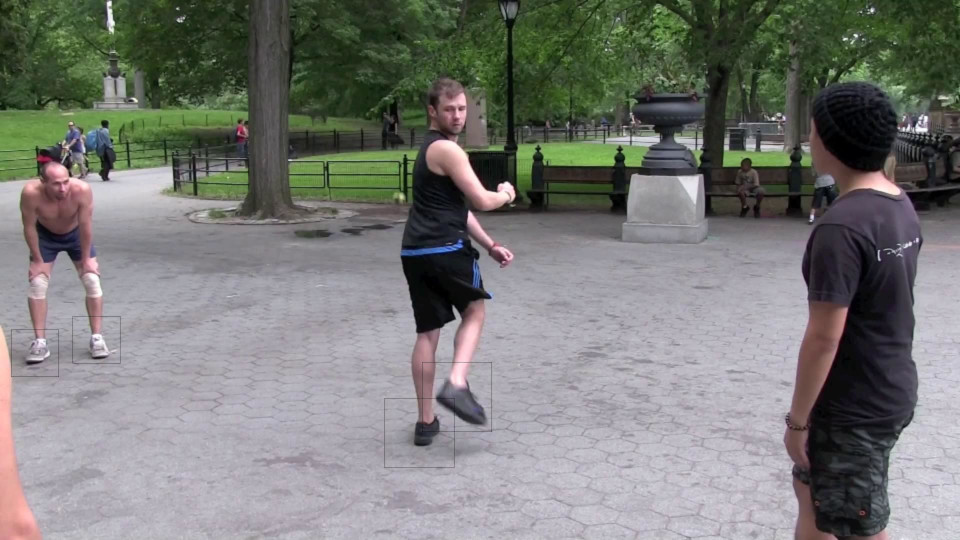
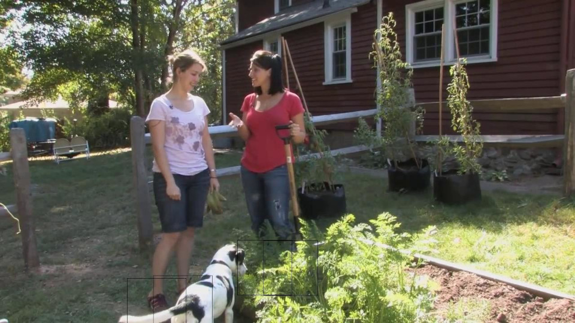

# BlackGoblin-Track

This repository is the result of a short investigation into classification of ground type and footwear, combined with object tracking for the purpose of automatated audio dubbing of footsteps in video.

## **Usage**

### **1. Dataset Prep**

Download GTOS dataset from https://1drv.ms/u/s!AmTf4gl42ObncLmEnEv4R5LyxT4?e=ekkFfX and extract to resources folder. So the structure should appear like this:

```
resources/
├── gtos
│   ├── color_imgs
│   ├── diff_imgs
│   └── labels
```

Then run `python Terrain/convert_gtos_keras_format.py` to convert GTOS into expected layout for training, also reduces the 39 classes to 4 (hard_stone, loose_stone, soft, vegetation) to help improve generalisability. This will output to Terrain/gtos_keras both train and test sets as below:

```
Terrain/gtos_keras/
├── test
│   ├── hard_stone
│   ├── loose_stone
│   ├── soft
│   └── veg
└── train
    ├── hard_stone
    ├── loose_stone
    ├── soft
    └── veg
```

### **2. Terrain Classifier Training**

The terrain classifier environment requires an updated pip and a number of modules. 

```
python -m pip install --upgrade pip
pip install tensorflow-gpu scikit-learn tabulate tensorflow_addons
```

If you run into problems getting tensorflow installed with GPU acceleration, there is a docker-compose file provided that should help to get a working environment. Run one of the commands below depending on OS. **Note** You may need to modify the volumes path in docker-compose.yml and remove the :z from the end of the path as this is linux specific.

```bash
# linux
podman-compose --podman-run-args="--security-opt=label=disable --gpus all --rm" run bg-track
# windows
docker compose run --rm bg-track
```

From either the containerised environment or from your live environment you can now train the model by running `python Terrain/trainModel.py`. Once complete this will save the model to outputs/models for use in the tracker.

### **3. Tracker with terrain prediction**

**The tracker cannot be run from the container as it has some interactive elements that require a GUI. (still requires tensorflow etc as before, but as the model is already trained GPU accel is not as important)**

Install dependencies:

```bash
pip install opencv-contrib-python numpy seaborn matplotlib
```

The Track/track_multi_terrain.py file contains a variable called **MODEL_FILE**. This should be modified to point to the model output by the trainModel.py step above.

The following command shows an example with switches which are described below. Switches can be ommited to use hard coded values within the script instead.

```bash
python Track/track_multi_terrain.py -s 2 -e 7 -n 1 -v "./resources/People Walking Free Stock Footage.mp4"
```

```bash
-s {number} # start time in seconds
-e {number} # end time in seconds
-n {number} # number of objects to track
-v {string} # relative path to a video file
```

Upon running the command the first frame will be shown and allow the user to drag a bounding box around a point of interest, press enter to accept. This repeats {n} times. Once all trackers have been set the video will begin to process each frame. Once complete outputs will be stored in the outputs/track directory.

Outputs consist of a txt file where each entry looks like `obj: 0, y: 483, p: [0], t: 2035.3`. This means object 0, ie the first tracked object selected, is at y position 483 pixels, and the ground type below the object is predicted to be class index 0, at time 2035.3 milliseconds. Classes are hard_stone, loose_stone, soft, veg as noted in previous section, indexes are in alphabetical order.

## **Overview**

The problem can be split into 3 main categories. Footwear classification, ground type classification, and object tracking of individual feet.

The instructions above walk through training a basic ground type classifier based on the GTOS dataset. This classifier model is then used inside a tracking loop with OpenCV to track each selected object within a given timeframe of a video.

For each frame and each object we track the y position in pixels over time and plot to a graph.

<p float="left">
  
  
  <br>(Left) Example tracking output frame. Blue box is the tracked object. Green box is the cropped region passed to ground classifier. (Right) Subsequent tracking. Y axis is y position in pixels, X axis is frame.
</p>

<p float="left">
  
  
  <br>Another example showing a different gait and correct classification of vegetation ground type.
</p>

## **Footwear Classification**

To build a classification model to differentiate footwear types, we need a labelled dataset of footwear. We found "Fashion MNIST", "Shoe Dataset", and "UT Zappos50k".

### **Dataset**

**Fashion MNIST** - https://www.kaggle.com/datasets/zalando-research/fashionmnist?resource=download&select=fashion-mnist_train.csv <br>
Fashion MNIST consists of 70k images of 28x28 greyscale. Although only a small subset of these are footwear, and only sneaker and boots are labelled.

**Shoe Dataset** - https://www.kaggle.com/datasets/noobyogi0100/shoe-dataset <br>
Shoe Dataset consists of 249 images categorised by Boots, Sneakers, Flip flops, Loafers, Sandals, and Football boots. This would likely be too small in practice.

**UT Zappos50k** - https://vision.cs.utexas.edu/projects/finegrained/utzap50k/ <br>
UT Zappos50k dataset seemed the most promising consisting of 50k images categorised by Shoes, Sandal, Slipper, Boot. These categories are further subdivided into sub-types.

<br>UT Zappos Dataset examples

### **Classifier**

Because YOLO can perform fast object tracking and identification, we experimented with transfer learning with yolov5 small and large networks using pretrained weights. We provided the model with train test split of UT Zappos50k data converted to YOLO format. It quickly became aparent that the model would not transfer well to real world examples, likely due to the identical orientation and lighting of each shoe in the dataset, and for some the fact that no feet were inside of them (strappy heels and sandals). 

We attempted to resolve this by augmenting the dataset in a number of ways such as changing background colour, skewing or rotating images and greyscaling the image before passing for training. However in the vast majority of cases YOLO could not find the shoe, even in an image filled with shoes, and when it did it would frequently misidentify.

### **Generating more data with Pose estimation dataset**

Another idea was to augment our existing Zappos dataset by providing it with annotated "Shoes in the wild" images. As it would be very time consuming to collect a significant number and annotate manually we opted to scrape the data from a pose estimation dataset, MPII Human Pose Dataset.

**MPII Human Pose Dataset** - http://human-pose.mpi-inf.mpg.de/

The Pose directory in this repo contains the python scripts required to convert from their matlab structure into a more understandable JSON structure with readmat_output_json.py. And then generate_dataset_from_json.py will take this JSON structure along with the dataset directory, and copy images where both ankles are visible in the frame. We draw bounding boxes around the expected foot location based on the annotated scale of the individual and their ankle position.

<br>Good annotation with MPII Pose. This could work  well for augmentation.

<br>Obscured annotation with MPII Pose. This does not work and would require manual removal from the dataset.

So there are two problems here. The dataset does not tell us if the feet themselves are obscured. If this was a statistically insignificant number it may not matter, but of the first 100 images roughly 40% were obscured in some way. Another issue is that if we are to use these generated images to augment the existing training data, we would still need to label the shoe type manually. This means that manually labelling is looking more like a necessity for accurate shoe classification.

............................Ideally we would have panoramic views of every shoe type in varying lighting conditions and then train a classifier on these types. But the dataset does not yet exist.

## **Ground Type Classification**

Limitations : Note that the model does not yet classify soft materials (sand soil mud etc) accurately. This could likely be improved with more data.

### **Dataset**

### **Classifier**

## **Object Tracking**

### **Model**