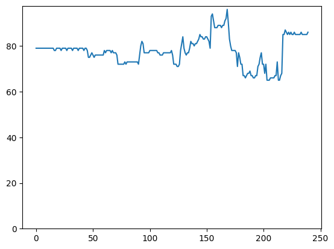
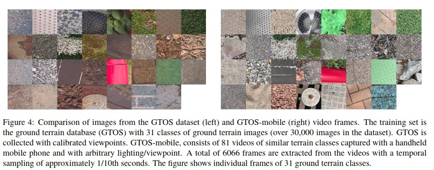
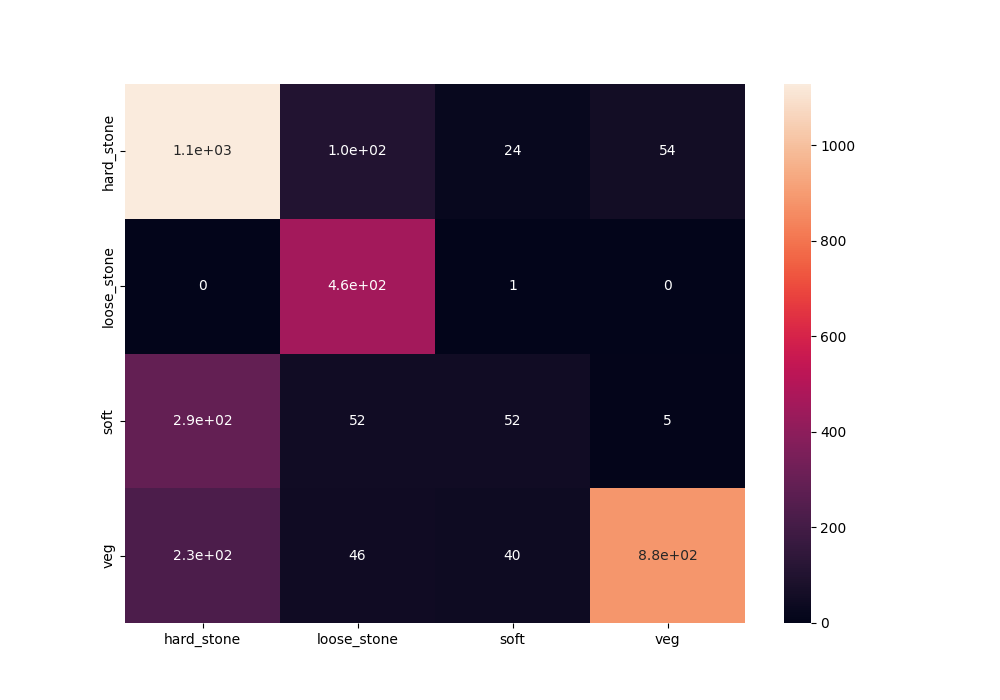

# BlackGoblin-Track

This repository is the result of a short investigation into classification of ground type and footwear, combined with object tracking for the purpose of automatated audio dubbing of footsteps in video.

## **Usage**

### **1. Dataset Prep**

Download GTOS dataset from https://1drv.ms/u/s!AmTf4gl42ObncLmEnEv4R5LyxT4?e=ekkFfX and extract to resources folder. So the structure should appear like this:

```
resources/
├── gtos
│   ├── color_imgs
│   ├── diff_imgs
│   └── labels
```

Then run `python Terrain/convert_gtos_keras_format.py` to convert GTOS into expected layout for training, also reduces the 39 classes to 4 (hard_stone, loose_stone, soft, vegetation) to help improve generalisability. This will output to Terrain/gtos_keras both train and test sets as below:

```
Terrain/gtos_keras/
├── test
│   ├── hard_stone
│   ├── loose_stone
│   ├── soft
│   └── veg
└── train
    ├── hard_stone
    ├── loose_stone
    ├── soft
    └── veg
```

### **2. Terrain Classifier Training**

The terrain classifier environment requires an updated pip and a number of modules. 

```
python -m pip install --upgrade pip
pip install tensorflow-gpu scikit-learn tabulate tensorflow_addons
```

If you run into problems getting tensorflow installed with GPU acceleration, there is a docker-compose file provided that should help to get a working environment. Run one of the commands below depending on OS. **Note** You may need to modify the volumes path in docker-compose.yml and remove the :z from the end of the path as this is linux specific.

```bash
# linux
podman-compose --podman-run-args="--security-opt=label=disable --gpus all --rm" run bg-track
# windows
docker compose run --rm bg-track
```

From either the containerised environment or from your live environment you can now train the model by running `python Terrain/trainModel.py`. Once complete this will save the model to outputs/models for use in the tracker.

### **3. Tracker with terrain prediction**

**The tracker cannot be run from the container as it has some interactive elements that require a GUI. (still requires tensorflow etc as before, but as the model is already trained GPU accel is not as important)**

Install dependencies:

```bash
pip install opencv-contrib-python numpy seaborn matplotlib
```

The Track/track_multi_terrain.py file contains a variable called **MODEL_FILE**. This should be modified to point to the model output by the trainModel.py step above.

The following command shows an example with switches which are described below. Switches can be ommited to use hard coded values within the script instead.

```bash
python Track/track_multi_terrain.py -s 2 -e 7 -n 1 -v "./resources/People Walking Free Stock Footage.mp4"
```

```bash
-s {number} # start time in seconds
-e {number} # end time in seconds
-n {number} # number of objects to track
-v {string} # relative path to a video file
```

Upon running the command the first frame will be shown and allow the user to drag a bounding box around a point of interest, press enter to accept. This repeats {n} times. Once all trackers have been set the video will begin to process each frame. Once complete outputs will be stored in the outputs/track directory.

Outputs consist of a txt file where each entry looks like `obj: 0, y: 483, p: [0], t: 2035.3`. This means object 0, ie the first tracked object selected, is at y position 483 pixels, and the ground type below the object is predicted to be class index 0, at time 2035.3 milliseconds. Classes are hard_stone, loose_stone, soft, veg as noted in previous section, indexes are in alphabetical order.

## **Overview**

The problem can be split into 3 main categories. Footwear classification, ground type classification, and object tracking of individual feet.

The instructions above walk through training a basic ground type classifier based on the GTOS dataset. This classifier model is then used inside a tracking loop with OpenCV to track each selected object within a given timeframe of a video.

For each frame and each object we track the y position in pixels over time and plot to a graph.

<p float="left">
  
  
  <br>(Left) Example tracking output frame. Blue box is the tracked object. Green box is the cropped region passed to ground classifier. (Right) Subsequent tracking. Y axis is y position in pixels, X axis is frame.
</p>

<p float="left">
  
  
  <br>Another example showing a different gait and correct classification of vegetation ground type.
</p>

<p float="left">
  
  
  <br>Shows realtime detection between surfaces. Tracker cannot track the other foot probably due to the faster motion and the change of shape. Also shows occlusion problem when feet cross.
</p>

## **Ground Type Classification**

To build a classification model to differentiate ground types, we found a number of material datasets. The most promising for our use case being GTOS and GTOS-Mobile.

### **Datasets**

**GTOS** - https://ieeexplore.ieee.org/document/9200748 <br>
Ground Terrain in Outdoor Scenes dataset. 30k images and 39 classes.

**GTOS-Mobile** - https://arxiv.org/pdf/1803.10896v1.pdf <br>
Ground Terrain in Outdoor Scenes Mobile dataset. 81 videos and 31 classes.



Due to time constraints we worked with GTOS only. We reduced the number of classes from 39 down to 4 primary catagories, Hard_Stone, Loose_Stone, Soft and Vegetation. These catagories were chosen based on the likelyhood of similar sounds being produced. These catagories were then used to group the existing GTOS classes together. Some classes were ommited like painting_cover and steel which had static identifying marks in the training images.

```
hard_stone : asphalt, brick, cement, stone_brick, stone_cement
loose_stone : asphalt_stone, pebble, stone_asphalt, stone_mud
veg : dry_grass, dry_leaf, grass, leaf, moss, mud, turf
soft : sand, soil, wood_chips
```

### **Classifier**

We use a simple LeNet architecture consisting of two convolution layers with 5x5 kernel with a dimensionality output of 32. With a maximum of 40 epochs (early stopping on val_catagorical_accuracy, min delta 0.01, patience of 5, resulted in stopping around 25 epochs).

```
Super simple LeNet
Model: "sequential"
_________________________________________________________________
 Layer (type)                Output Shape              Param #   
=================================================================
 conv2d (Conv2D)             (None, 236, 236, 32)      2432      
                                                                 
 activation (Activation)     (None, 236, 236, 32)      0         
                                                                 
 conv2d_1 (Conv2D)           (None, 232, 232, 32)      25632     
                                                                 
 activation_1 (Activation)   (None, 232, 232, 32)      0         
                                                                 
 flatten (Flatten)           (None, 1722368)           0         
                                                                 
 dense (Dense)               (None, 64)                110231616 
                                                                 
 activation_2 (Activation)   (None, 64)                0         
                                                                 
 dense_1 (Dense)             (None, 4)                 260       
                                                                 
 activation_3 (Activation)   (None, 4)                 0         
                                                                 
=================================================================
Total params: 110,259,940
Trainable params: 110,259,940
Non-trainable params: 0
```

Prediction on test sets test1.txt and test2.txt from GTOS datasets show around 80% f1 score for 3 of the classes. Soft class (sand soil mud etc) scored poorly. This can also be seen clearly on the confusion matrix.

```
                   precision recall   f1-score   support
  hard_stone       0.69      0.86      0.76      1311
 loose_stone       0.69      1.00      0.82       456
        soft       0.44      0.13      0.20       399
         veg       0.94      0.74      0.83      1197

    accuracy                           0.75      3363
   macro avg       0.69      0.68      0.65      3363
weighted avg       0.75      0.75      0.73      3363
```


<br>Confusion matrix predicting the first two test sets (test1.txt and test2.txt). Hard stone and loose stone are generally well predicted. Soft, which includes sand and dirt and other small particles, is very poor.<br>
<br>
Given that this model is a simple architecture and only using a subset of images from one dataset, accuracy here could be greatly increased with more training data and additional effort. 

## **Footwear Classification**

To build a classification model to differentiate footwear types, we need a labelled dataset of footwear. We found "Fashion MNIST", "Shoe Dataset", and "UT Zappos50k".

### **Datasets**

**Fashion MNIST** - https://www.kaggle.com/datasets/zalando-research/fashionmnist?resource=download&select=fashion-mnist_train.csv <br>
Fashion MNIST consists of 70k images of 28x28 greyscale. Although only a small subset of these are footwear, and only sneaker and boots are labelled.

**Shoe Dataset** - https://www.kaggle.com/datasets/noobyogi0100/shoe-dataset <br>
Shoe Dataset consists of 249 images categorised by Boots, Sneakers, Flip flops, Loafers, Sandals, and Football boots. This would likely be too small in practice.

**UT Zappos50k** - https://vision.cs.utexas.edu/projects/finegrained/utzap50k/ <br>
UT Zappos50k dataset seemed the most promising consisting of 50k images categorised by Shoes, Sandal, Slipper, Boot. These categories are further subdivided into sub-types.

<br>UT Zappos Dataset examples

### **Classifier**

Because YOLO can perform fast object tracking and identification, we experimented with transfer learning with yolov5 small and large networks using pretrained weights. We provided the model with train test split of UT Zappos50k data converted to YOLO format. It quickly became aparent that the model would not transfer well to real world examples, likely due to the identical orientation and lighting of each shoe in the dataset, and for some instances, the fact that no feet were inside of them (strappy heels and sandals). 

We attempted to resolve this by augmenting the dataset in a number of ways such as changing background colour, skewing or rotating images and greyscaling the image before passing for training. However in the vast majority of cases YOLO could not find the shoe, even in an image filled with shoes. On the rare occasions it detected a shoe it would frequently misidentify.

### **Generating more data with Pose estimation dataset**

Another approach explored was to augment our existing Zappos dataset by providing it with annotated "Shoes in the wild" images. As it would be very time consuming to collect a significant number and annotate manually we opted to scrape the data from a pose estimation dataset, MPII Human Pose Dataset.

**MPII Human Pose Dataset** - http://human-pose.mpi-inf.mpg.de/

The Pose directory in this repo contains the python scripts required to convert from their matlab structure into a more understandable JSON structure with readmat_output_json.py. And then generate_dataset_from_json.py will take this JSON structure along with the dataset directory, and copy images where both ankles are visible in the frame. We draw bounding boxes around the expected foot location based on the annotated scale of the individual and their ankle position.

<br>Good annotation with MPII Pose. This could work  well for augmentation.

<br>Obscured annotation with MPII Pose. This does not work and would require manual removal from the dataset.

There are two major problems here. The dataset does not tell us if the feet themselves are obscured. If this was a statistically insignificant number it may not matter, but of the first 100 images roughly 40% were obscured in some way. Another issue is that if we are to use these generated images to augment the existing training data, we would still need to label the shoe type manually. This means that manually labelling is looking more like a necessity for accurate shoe classification.

## **Future Work**

### **Tracker**

Interestingly, given the 3 examples graphed in the previous section, it appears it may be possible to derive more information than just contact time and pacing, such as intensity of contact. Comparing the first (woman on wall) and second (woman on grass) graphs, we can see the woman on wall is placing her foot down with more force, this is reflected by a steeper gradient in the graph. The woman on the grass has a different gait however, and only the second trough represents the foot actually being placed down, but we can still see on the second declination, a shallower angle, which represents a gentler placement. 

The third graph shows a very chaotic example, but even this could potentially be used to produce a good estimate of sound. Lots of small chaotic movements on a hard stone surface would produce a lot of short "scuffs". This short test implies that the appearance of a graph can likely inform how they should sound.

Further research can be conducted in this area to determine if it is possible to reconstruct sensible sound representations from the visual data, and how this can best be achieved. 

The occlusion problem is a common issue with object tracking. Another issue is uniformity. When detecting two feet in motion we suffer from both issues. When two feet cross over, which they will do frequently, the tracker will not know that the rear foot is now behind the front foot, because of uniformity of the feet. So in effect two trackers that start on individual feet will end up tracking one foot. This is a challenging problem and would require further research to find a suitable solution.

### **Alternative to tracker - Pose estimator**

If a tracker cannot be used to resolve the issue adequetly, then perhaps a pose estimation model could. If we could estimate pose accurately for each frame using an existing model, we could derive ankle or feet positions from this. I believe this has the potential to solve the problem, although it does depend on accuracy of existing models. Further time could be spent investigating this area of research in order to identify efficacy of such an approach.

### **Ground Classifier**

The ground surface classifier could be greatly improved with more data and more work. Training with more data, specifically to target the softer surfaces and introduce new surfaces, like metal and snow, would allow for a wider array of possible classifications and use cases.

### **Footwear Classifier**

Finally, accurate detection of shoe type requires a model trained on a labelled dataset. Currently no useable dataset exists. So a potential area of work is to manually collect a dataset for this explicit purpose. This would be time consuming work but it is likely the only way to automate this aspect. 

One approach would be to work on the above areas (like tracking/pose estimation) to derive meaningful bounding boxes around the feet, specify manually the shoe type at runtime, and store the resulting annotated frames for future use. These annotated frames could then form the basis of a future dataset and shoe classification model.